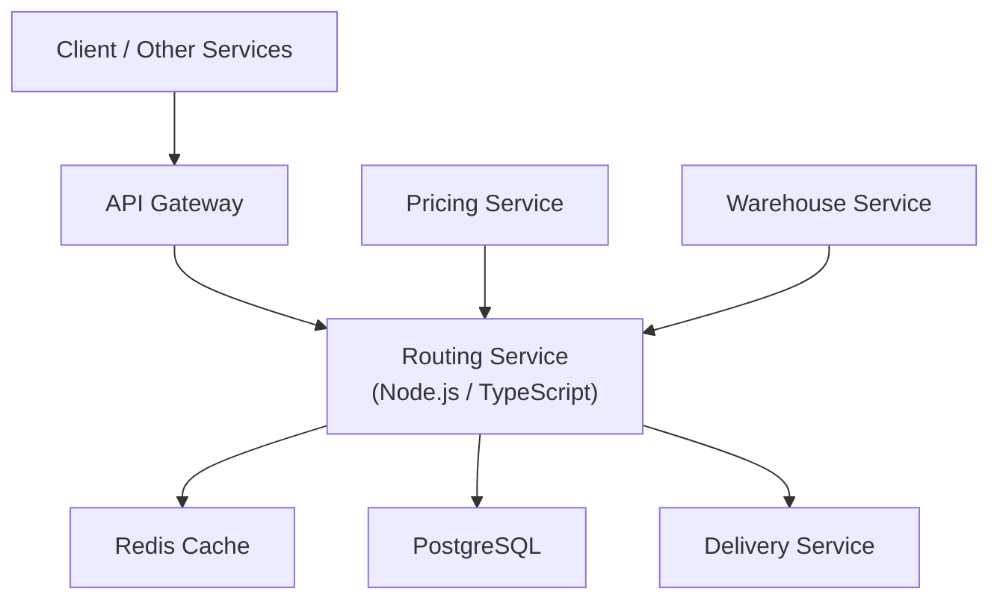

# Design Document: Routing Service

## Overview

Routing Service adalah microservice stateless dalam platform pengiriman ekspres yang menyediakan dua kapabilitas utama:

1. **Inter-Hub Routing**: Menghitung rute optimal antar hub distribusi menggunakan algoritma Dijkstra dengan bobot kombinasi jarak dan waktu tempuh.
2. **Courier Delivery Routing**: Menghitung rute pengantaran harian kurir menggunakan nearest neighbor heuristic sebagai TSP approximation berdasarkan koordinat lat/lng.

Layanan dibangun sebagai Node.js (TypeScript) REST API dengan Redis sebagai cache layer dan PostgreSQL sebagai persistent storage. Target beban: ~1000 req/sec dengan latensi cached response < 500ms.

---

## Architecture



### Deployment

- Containerized via Docker, orchestrated dengan Kubernetes.
- Horizontal scaling di belakang load balancer.
- Redis digunakan sebagai shared cache antar instance (tidak in-process).
- Stateless: tidak ada state lokal di instance.

---

## Components and Interfaces

### 1. HTTP Layer (Gin Router)

Menangani routing HTTP, validasi input awal, dan serialisasi response.

```
GET  /routing/route
GET  /routing/nodes
POST /routing/nodes
GET  /routing/edges
POST /routing/edges
PATCH /routing/edges/:edge_id
GET  /routing/courier-route/:courier_id
```

### 2. Route Calculator (Inter-Hub)

Mengimplementasikan algoritma Dijkstra pada graf route_nodes + route_edges. Bobot edge = `alpha * distance_km + beta * avg_transit_hours` (alpha dan beta dapat dikonfigurasi via environment variable).

Interface:
```go
type InterHubCalculator interface {
    Calculate(graph *Graph, origin, destination string) (*InterHubRoute, error)
}
```

### 3. Courier Route Calculator

Mengimplementasikan nearest neighbor heuristic. Titik awal selalu hub kurir. Jarak antar titik dihitung menggunakan Haversine formula pada koordinat lat/lng.

Interface:
```go
type CourierRouteCalculator interface {
    Calculate(courierID string, points []DeliveryPoint, hub HubOrigin) *CourierRoute
}
```

### 4. Cache Service

Abstraksi di atas Redis client. Menangani serialisasi/deserialisasi JSON, TTL management, dan fallback logic.

```go
type CacheService interface {
    Get(ctx context.Context, key string, dest interface{}) error
    Set(ctx context.Context, key string, value interface{}, ttl time.Duration) error
    InvalidatePattern(ctx context.Context, pattern string) error
}
```

Cache keys:
- Inter-hub: `route:{origin}:{destination}:{service_type}` — TTL 24 jam (86400 detik)
- Courier: `courier_route:{courier_id}:{YYYY-MM-DD}` — TTL 10 menit (600 detik)

### 5. Graph Repository

Akses data ke PostgreSQL untuk route_nodes dan route_edges.

```go
type GraphRepository interface {
    GetAllNodes(ctx context.Context) ([]RouteNode, error)
    CreateNode(ctx context.Context, data CreateNodeInput) (*RouteNode, error)
    GetAllEdges(ctx context.Context, fromNodeID *string) ([]RouteEdge, error)
    CreateEdge(ctx context.Context, data CreateEdgeInput) (*RouteEdge, error)
    UpdateEdge(ctx context.Context, edgeID string, data UpdateEdgeInput) (*RouteEdge, error)
    GetActiveGraph(ctx context.Context) (*Graph, error)
}
```

### 6. External Service Clients

```go
type DeliveryServiceClient interface {
    GetCourierDeliveryPoints(ctx context.Context, courierID, date string) ([]DeliveryPoint, error)
    GetCourierHub(ctx context.Context, courierID string) (*HubOrigin, error)
}
```

---

## Data Models

### route_nodes

| Column    | Type          | Constraint |
|-----------|---------------|------------|
| node_id   | VARCHAR(36)   | PK, UUID   |
| hub_id    | VARCHAR(50)   | UNIQUE     |
| city_code | VARCHAR(10)   | NOT NULL   |
| latitude  | DECIMAL(9,6)  | NOT NULL   |
| longitude | DECIMAL(9,6)  | NOT NULL   |

### route_edges

| Column           | Type          | Constraint                        |
|------------------|---------------|-----------------------------------|
| edge_id          | VARCHAR(36)   | PK, UUID                          |
| from_node_id     | VARCHAR(36)   | FK → route_nodes.node_id          |
| to_node_id       | VARCHAR(36)   | FK → route_nodes.node_id          |
| distance_km      | DECIMAL(10,2) | NOT NULL                          |
| avg_transit_hours| DECIMAL(6,2)  | NOT NULL                          |
| transport_mode   | ENUM          | DARAT \| UDARA \| LAUT            |
| is_active        | BOOLEAN       | DEFAULT true                      |

### route_cache (Redis — bukan tabel DB)

| Key Pattern                                  | Value     | TTL      |
|----------------------------------------------|-----------|----------|
| `route:{origin}:{destination}:{service_type}`| JSON string | 24 jam |
| `courier_route:{courier_id}:{date}`          | JSON string | 10 menit |

### Go Structs

```go
type RouteNode struct {
    NodeID    string  `json:"node_id" db:"node_id"`
    HubID     string  `json:"hub_id" db:"hub_id"`
    CityCode  string  `json:"city_code" db:"city_code"`
    Latitude  float64 `json:"latitude" db:"latitude"`
    Longitude float64 `json:"longitude" db:"longitude"`
}

type RouteEdge struct {
    EdgeID          string  `json:"edge_id" db:"edge_id"`
    FromNodeID      string  `json:"from_node_id" db:"from_node_id"`
    ToNodeID        string  `json:"to_node_id" db:"to_node_id"`
    DistanceKm      float64 `json:"distance_km" db:"distance_km"`
    AvgTransitHours float64 `json:"avg_transit_hours" db:"avg_transit_hours"`
    TransportMode   string  `json:"transport_mode" db:"transport_mode"` // DARAT | UDARA | LAUT
    IsActive        bool    `json:"is_active" db:"is_active"`
}

type InterHubRouteStop struct {
    HubID    string `json:"hub_id"`
    City     string `json:"city"`
    Sequence int    `json:"sequence"`
}

type InterHubRoute struct {
    Origin               string              `json:"origin"`
    Destination          string              `json:"destination"`
    Route                []InterHubRouteStop `json:"route"`
    TotalDistanceKm      float64             `json:"total_distance_km"`
    EstimatedTransitHours float64            `json:"estimated_transit_hours"`
}

type DeliveryPoint struct {
    DeliveryID      string  `json:"delivery_id"`
    TrackingNumber  string  `json:"tracking_number"`
    RecipientName   string  `json:"recipient_name"`
    Address         string  `json:"address"`
    Lat             float64 `json:"lat"`
    Lng             float64 `json:"lng"`
}

type HubOrigin struct {
    HubID string  `json:"hub_id"`
    Lat   float64 `json:"lat"`
    Lng   float64 `json:"lng"`
    Label string  `json:"label"`
}

type CourierRouteStop struct {
    Sequence           int     `json:"sequence"`
    TrackingNumber     string  `json:"tracking_number"`
    DeliveryID         string  `json:"delivery_id"`
    RecipientName      string  `json:"recipient_name"`
    Address            string  `json:"address"`
    Lat                float64 `json:"lat"`
    Lng                float64 `json:"lng"`
    EstimatedArrival   string  `json:"estimated_arrival"`
    DistanceFromPrevKm float64 `json:"distance_from_prev_km"`
}

type CourierRoute struct {
    CourierID                    string             `json:"courier_id"`
    HubID                        string             `json:"hub_id"`
    Origin                       HubOrigin          `json:"origin"`
    OptimizedRoute               []CourierRouteStop `json:"optimized_route"`
    TotalStops                   int                `json:"total_stops"`
    TotalDistanceKm              float64            `json:"total_distance_km"`
    EstimatedTotalDurationMinutes float64           `json:"estimated_total_duration_minutes"`
}

// Graph representation used by Dijkstra
type Graph struct {
    Nodes map[string]*RouteNode // keyed by hub_id
    Edges []RouteEdge
}

// DTOs for repository operations
type CreateNodeInput struct {
    HubID     string  `json:"hub_id" binding:"required"`
    CityCode  string  `json:"city_code" binding:"required"`
    Latitude  float64 `json:"latitude" binding:"required"`
    Longitude float64 `json:"longitude" binding:"required"`
}

type CreateEdgeInput struct {
    FromNodeID      string  `json:"from_node_id" binding:"required"`
    ToNodeID        string  `json:"to_node_id" binding:"required"`
    DistanceKm      float64 `json:"distance_km" binding:"required,gt=0"`
    AvgTransitHours float64 `json:"avg_transit_hours" binding:"required,gt=0"`
    TransportMode   string  `json:"transport_mode" binding:"required,oneof=DARAT UDARA LAUT"`
    IsActive        *bool   `json:"is_active"`
}

type UpdateEdgeInput struct {
    DistanceKm      *float64 `json:"distance_km" binding:"omitempty,gt=0"`
    AvgTransitHours *float64 `json:"avg_transit_hours" binding:"omitempty,gt=0"`
    TransportMode   *string  `json:"transport_mode" binding:"omitempty,oneof=DARAT UDARA LAUT"`
    IsActive        *bool    `json:"is_active"`
}
```

---

## Correctness Properties

*A property is a characteristic or behavior that should hold true across all valid executions of a system-essentially, a formal statement about what the system should do. Properties serve as the bridge between human-readable specifications and machine-verifiable correctness guarantees.*

### Property 1: Inter-hub route sequence integrity

*For any* valid origin and destination with a connected path of active edges, the returned route sequence SHALL start at the origin hub and end at the destination hub, with each consecutive hub connected by an active edge in the graph.

**Validates: Requirements 1.1, 1.2**

---

### Property 2: Route cache round-trip consistency

*For any* valid `InterHubRoute` or `CourierRoute` object, serializing it to JSON and deserializing it back SHALL produce an object that is deeply equal to the original, with no data loss or type coercion.

**Validates: Requirements 5.3**

---

### Property 3: Nearest neighbor route starts at hub

*For any* courier with N delivery points (N ≥ 1), the optimized courier route SHALL have sequence 1 as the delivery point closest to the hub origin, and the `distance_from_prev_km` of sequence 1 SHALL equal the Haversine distance from the hub to that delivery point.

**Validates: Requirements 4.2**

---

### Property 4: Courier route covers all delivery points

*For any* set of delivery points assigned to a courier, the optimized route SHALL contain exactly the same set of `delivery_id` values — no additions, no omissions.

**Validates: Requirements 4.2, 4.3**

---

### Property 5: Total distance consistency

*For any* courier route, the `total_distance_km` SHALL equal the sum of all `distance_from_prev_km` values across all stops in `optimized_route`.

**Validates: Requirements 4.3**

---

### Property 6: Edge update invalidates affected cache

*For any* cached inter-hub route that traverses a given edge, updating that edge SHALL result in the cache entry being invalidated so the next request recalculates the route.

**Validates: Requirements 3.4**

---

### Property 7: Empty delivery points returns zero totals

*For any* courier with zero delivery points assigned, the returned courier route SHALL have an empty `optimized_route` array, `total_stops` of 0, `total_distance_km` of 0, and `estimated_total_duration_minutes` of 0.

**Validates: Requirements 4.6**

---

### Property 8: Dijkstra optimality — no shorter path exists

*For any* computed inter-hub route, no alternative path through active edges SHALL have a lower combined weight (distance + transit time) than the returned route.

**Validates: Requirements 1.2**

---

## Error Handling

| Scenario | HTTP Status | Response |
|---|---|---|
| No route found between origin and destination | 404 | `{ "error": "NO_ROUTE_FOUND", "message": "..." }` |
| Duplicate hub_id on node creation | 409 | `{ "error": "DUPLICATE_HUB", "message": "..." }` |
| Referenced node not found on edge creation | 404 | `{ "error": "NODE_NOT_FOUND", "message": "..." }` |
| Edge not found on PATCH | 404 | `{ "error": "EDGE_NOT_FOUND", "message": "..." }` |
| Invalid transport_mode | 400 | `{ "error": "VALIDATION_ERROR", "message": "..." }` |
| Missing required fields | 400 | `{ "error": "VALIDATION_ERROR", "fields": [...] }` |
| Delivery Service unavailable | 503 | `{ "error": "UPSTREAM_UNAVAILABLE", "message": "..." }` |
| Redis unavailable | — | Fallback to DB computation, no error to client |
| Malformed query parameters | 400 | `{ "error": "VALIDATION_ERROR", "message": "..." }` |

---

## Testing Strategy

### Property-Based Testing

Library: **`pgregory.net/rapid`** (Go)

Each property-based test MUST:
- Run a minimum of **100 iterations** (configured via `rapid.Check` with `rapid.WithMaxRuns(100)`)
- Be tagged with a comment in the format: `// Feature: routing-service, Property {N}: {property_text}`
- Reference the correctness property it validates: `// Validates: Requirements X.Y`
- Each correctness property is implemented by a **single** property-based test using `rapid.MakeT`

Properties to implement as PBT:
- Property 1: Inter-hub route sequence integrity
- Property 2: Route cache round-trip consistency
- Property 3: Nearest neighbor route starts at hub
- Property 4: Courier route covers all delivery points
- Property 5: Total distance consistency
- Property 7: Empty delivery points returns zero totals
- Property 8: Dijkstra optimality

### Unit Testing

Library: **`testing`** (Go standard library) + **`testify`** for assertions

Unit tests cover:
- Haversine distance calculation correctness with known coordinate pairs
- Dijkstra on small hand-crafted graphs with known shortest paths
- Cache key generation for both inter-hub and courier routes
- Validation logic for node/edge creation request bodies
- Error response formatting
- Redis fallback behavior when cache is unavailable

### Integration Testing

- End-to-end API tests using `net/http/httptest` against a running Gin instance with a test PostgreSQL database and Redis
- Mock external services (Delivery Service) using `net/http/httptest` server stubs
- Test cache hit vs cache miss behavior
- Test cache invalidation on edge update
