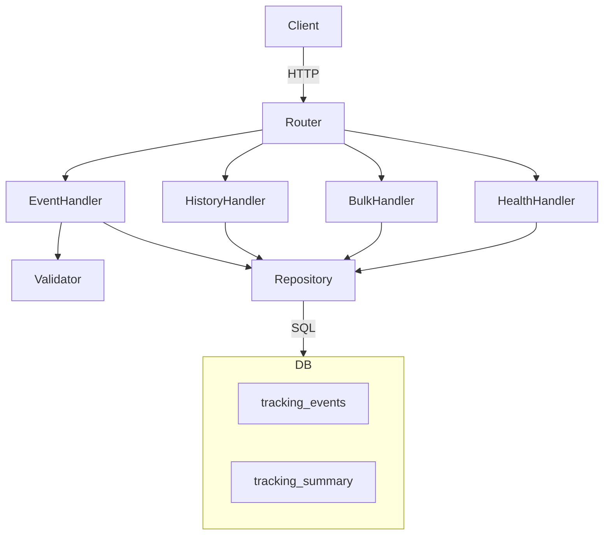

# Design Document: tracking-service

## Overview

The `tracking-service` is a stateless Go microservice that manages packet status history using an event-based, append-only architecture. It exposes three HTTP endpoints:

- `POST /tracking/events` — record a new tracking event
- `GET /tracking/{tracking_number}` — retrieve full history for a single packet
- `GET /tracking/bulk?numbers=TRK1,TRK2,...` — retrieve summaries for up to 100 packets

The service targets ~10,000 requests per second. All state lives in a relational database (PostgreSQL) across two tables: an immutable event log (`tracking_events`) and a current-state projection (`tracking_summary`). The service itself holds no in-process state between requests.

### Key Design Decisions

- **Append-only event store**: `tracking_events` is never updated or deleted. This gives a tamper-proof audit trail and enables replay/re-projection.
- **Summary projection**: `tracking_summary` is upserted atomically within the same transaction as the event insert, keeping single-field lookups O(1) without scanning history.
- **Stateless service**: No goroutine-local or request-local state is shared. All concurrency safety comes from the database layer (row-level locks, transactions).
- **Standard library + minimal dependencies**: Use `net/http` (or a thin router like `chi`) for routing, `database/sql` with `pgx` driver for PostgreSQL, and `encoding/json` for serialization. No ORM.

---

## Architecture



### Request Lifecycle

1. The HTTP router receives a request and attaches a correlation ID (UUID v4) to the request context.
2. A logging middleware records method, path, and correlation ID at request start; records status code and latency at completion.
3. The appropriate handler validates input, calls the repository, and writes the JSON response.
4. All database operations carry a context with a 5-second deadline; exceeding it cancels the query and returns HTTP 504.

### Concurrency Model

- Go's `net/http` server handles each request in its own goroutine.
- The `database/sql` connection pool is shared across all goroutines; `maxOpenConns` is configurable.
- For `POST /tracking/events`, the event insert and summary upsert run inside a single database transaction with a row-level lock on the `tracking_summary` row to prevent concurrent summary corruption.

---

## Components and Interfaces

### Router / Middleware

Registers routes and applies middleware in order:

1. **CorrelationID middleware** — generates or propagates a `X-Correlation-ID` header; stores it in `context.Context`.
2. **Logging middleware** — structured log entry per request (method, path, status, latency ms, correlation ID).
3. **Recovery middleware** — catches panics, logs them, returns HTTP 500.

Routes:
```
POST   /tracking/events
GET    /tracking/{tracking_number}
GET    /tracking/bulk
GET    /health
```

### Handlers

```go
// EventHandler handles POST /tracking/events
type EventHandler struct {
    repo Repository
}

// HistoryHandler handles GET /tracking/{tracking_number}
type HistoryHandler struct {
    repo Repository
}

// BulkHandler handles GET /tracking/bulk
type BulkHandler struct {
    repo Repository
}

// HealthHandler handles GET /health
type HealthHandler struct {
    repo Repository
}
```

Each handler is responsible for:
- Parsing and validating the request
- Calling the repository
- Writing the JSON response with the correct status code

### Validator

A pure validation layer with no I/O dependencies:

```go
// ValidateCreateEventRequest validates the POST /tracking/events body.
// Returns a list of field-level errors.
func ValidateCreateEventRequest(req CreateEventRequest) []ValidationError

// ValidateStatus returns true if s is a known Status value.
func ValidateStatus(s string) bool

// ValidateTimestamp returns true if s is a valid RFC 3339 string.
func ValidateTimestamp(s string) bool

// ValidateBulkNumbers validates the numbers slice (1–100 items, non-empty strings).
func ValidateBulkNumbers(numbers []string) []ValidationError
```

### Repository Interface

```go
type Repository interface {
    // InsertEventAndUpsertSummary persists the event and upserts the summary
    // in a single transaction with a row-level lock on the summary row.
    InsertEventAndUpsertSummary(ctx context.Context, event TrackingEvent) error

    // GetEventsByTrackingNumber returns all events for a tracking number,
    // ordered by timestamp ascending. Returns ErrNotFound if none exist.
    GetEventsByTrackingNumber(ctx context.Context, trackingNumber string) ([]TrackingEvent, error)

    // GetSummaryByTrackingNumber returns the summary for a tracking number.
    // Returns ErrNotFound if it does not exist.
    GetSummaryByTrackingNumber(ctx context.Context, trackingNumber string) (TrackingSummary, error)

    // GetSummariesByTrackingNumbers returns summaries for all provided tracking
    // numbers in a single query. Missing numbers are silently omitted.
    GetSummariesByTrackingNumbers(ctx context.Context, numbers []string) ([]TrackingSummary, error)

    // Ping checks database connectivity.
    Ping(ctx context.Context) error
}
```

Sentinel errors:
```go
var ErrNotFound = errors.New("not found")
var ErrPoolExhausted = errors.New("connection pool exhausted")
```

---

## Data Models

### Go Structs

```go
// Status is the enumerated lifecycle state of a packet.
type Status string

const (
    StatusCreated         Status = "CREATED"
    StatusPickedUp        Status = "PICKED_UP"
    StatusArrivedAtHub    Status = "ARRIVED_AT_HUB"
    StatusInTransit       Status = "IN_TRANSIT"
    StatusOutForDelivery  Status = "OUT_FOR_DELIVERY"
    StatusDelivered       Status = "DELIVERED"
    StatusFailedDelivery  Status = "FAILED_DELIVERY"
    StatusReturned        Status = "RETURNED"
)

// TrackingEvent is the immutable domain record stored in tracking_events.
type TrackingEvent struct {
    EventID          string    `json:"event_id"`
    TrackingNumber   string    `json:"tracking_number"`
    Status           Status    `json:"status"`
    Location         string    `json:"location,omitempty"`
    HubID            string    `json:"hub_id,omitempty"`
    Notes            string    `json:"notes,omitempty"`
    CreatedByService string    `json:"created_by_service"`
    Timestamp        time.Time `json:"timestamp"`
}

// TrackingSummary is the current-state projection stored in tracking_summary.
type TrackingSummary struct {
    TrackingNumber    string     `json:"tracking_number"`
    CurrentStatus     Status     `json:"current_status"`
    LastLocation      string     `json:"last_location,omitempty"`
    EstimatedDelivery *time.Time `json:"estimated_delivery"`
    UpdatedAt         time.Time  `json:"updated_at"`
}
```

### HTTP Request / Response Structs

```go
// CreateEventRequest is the body for POST /tracking/events.
type CreateEventRequest struct {
    TrackingNumber string `json:"tracking_number"`
    Status         string `json:"status"`
    Location       string `json:"location,omitempty"`
    HubID          string `json:"hub_id,omitempty"`
    Notes          string `json:"notes,omitempty"`
    Timestamp      string `json:"timestamp"` // RFC 3339
}

// CreateEventResponse is the 201 body for POST /tracking/events.
type CreateEventResponse struct {
    EventID string `json:"event_id"`
}

// HistoryEntry is one element in the history array.
type HistoryEntry struct {
    Status    Status    `json:"status"`
    Timestamp time.Time `json:"timestamp"`
}

// TrackingHistoryResponse is the 200 body for GET /tracking/{tracking_number}.
type TrackingHistoryResponse struct {
    TrackingNumber    string         `json:"tracking_number"`
    CurrentStatus     Status         `json:"current_status"`
    EstimatedDelivery *time.Time     `json:"estimated_delivery"`
    History           []HistoryEntry `json:"history"`
}

// ErrorResponse is the body for all 4xx/5xx responses.
type ErrorResponse struct {
    Error         string `json:"error"`
    CorrelationID string `json:"correlation_id"`
}
```

### Database Schema

```sql
CREATE TABLE tracking_events (
    event_id          UUID        PRIMARY KEY DEFAULT gen_random_uuid(),
    tracking_number   TEXT        NOT NULL,
    status            TEXT        NOT NULL,
    location          TEXT,
    hub_id            TEXT,
    notes             TEXT,
    created_by_service TEXT       NOT NULL DEFAULT 'tracking-service',
    timestamp         TIMESTAMPTZ NOT NULL
);

CREATE INDEX idx_tracking_events_tracking_number
    ON tracking_events (tracking_number);

CREATE TABLE tracking_summary (
    tracking_number    TEXT        PRIMARY KEY,
    current_status     TEXT        NOT NULL,
    last_location      TEXT,
    estimated_delivery TIMESTAMPTZ,
    updated_at         TIMESTAMPTZ NOT NULL
);
```

### Configuration

```go
type Config struct {
    HTTPPort        int    // default 8080
    DatabaseDSN     string // PostgreSQL connection string
    DBMaxOpenConns  int    // default 50
    DBMaxIdleConns  int    // default 10
    DBQueryTimeout  time.Duration // default 5s
}
```

---

## Correctness Properties

*A property is a characteristic or behavior that should hold true across all valid executions of a system — essentially, a formal statement about what the system should do. Properties serve as the bridge between human-readable specifications and machine-verifiable correctness guarantees.*

### Property 1: Valid event creation round-trip

*For any* valid `CreateEventRequest` (non-empty `tracking_number`, valid `status`, valid RFC 3339 `timestamp`), posting it to `POST /tracking/events` SHALL return HTTP 201 with a non-empty `event_id` that is a valid UUID v4, and the stored event SHALL have `created_by_service = "tracking-service"` and all provided fields preserved.

**Validates: Requirements 1.1, 1.7, 4.2**

---

### Property 2: Missing required fields return HTTP 400 identifying the missing field(s)

*For any* `POST /tracking/events` request body where one or more of `tracking_number`, `status`, or `timestamp` is absent or empty, the service SHALL return HTTP 400 and the error message SHALL name every missing or empty field.

**Validates: Requirements 1.2, 1.3**

---

### Property 3: Invalid status value returns HTTP 422

*For any* string that is not a member of the defined Status enumeration (`CREATED`, `PICKED_UP`, `ARRIVED_AT_HUB`, `IN_TRANSIT`, `OUT_FOR_DELIVERY`, `DELIVERED`, `FAILED_DELIVERY`, `RETURNED`), submitting it as the `status` field SHALL cause the service to return HTTP 422 with an error message that lists the valid status values.

**Validates: Requirements 1.4**

---

### Property 4: Invalid timestamp format returns HTTP 422

*For any* string that is not a valid RFC 3339 date-time, submitting it as the `timestamp` field SHALL cause the service to return HTTP 422 with an error message indicating the expected RFC 3339 format.

**Validates: Requirements 1.5**

---

### Property 5: Summary projection reflects the most recent event

*For any* sequence of one or more events posted for the same `tracking_number`, a subsequent `GET /tracking/{tracking_number}` SHALL return HTTP 200 with `current_status` equal to the `status` of the event with the latest `timestamp`, and the `history` array SHALL contain exactly one entry per posted event ordered by `timestamp` ascending.

**Validates: Requirements 1.6, 2.1, 2.2, 2.5, 5.2**

---

### Property 6: Non-existent tracking number returns HTTP 404

*For any* `tracking_number` string for which no events have been posted, a `GET /tracking/{tracking_number}` request SHALL return HTTP 404 with a descriptive error message.

**Validates: Requirements 2.3**

---

### Property 7: estimated_delivery serialization

*For any* tracking summary, if `estimated_delivery` is set then the `GET /tracking/{tracking_number}` response SHALL include it as a non-null RFC 3339 string; if it is not set, the response SHALL include `"estimated_delivery": null`.

**Validates: Requirements 2.6**

---

### Property 8: Bulk query returns exactly the existing tracking numbers

*For any* set of tracking numbers where a subset exists in the store, `GET /tracking/bulk?numbers=...` SHALL return HTTP 200 with a JSON array containing exactly one summary object per existing tracking number and no entries for non-existing tracking numbers.

**Validates: Requirements 3.1, 3.5**

---

### Property 9: Bulk query count boundary

*For any* list of 1 to 100 tracking numbers, the bulk endpoint SHALL not return HTTP 422. *For any* list of more than 100 tracking numbers, the bulk endpoint SHALL return HTTP 422 with an error message stating the maximum allowed count.

**Validates: Requirements 3.2, 3.4**

---

### Property 10: JSON serialization round-trip

*For any* valid `CreateEventRequest` struct, serializing it to JSON and then deserializing it SHALL produce a struct with equivalent field values; repeating the cycle (serialize → deserialize → serialize → deserialize) SHALL produce the same result.

**Validates: Requirements 6.4**

---

### Property 11: All responses carry Content-Type: application/json

*For any* request to any endpoint, the HTTP response SHALL have `Content-Type: application/json` (or `application/json; charset=utf-8`).

**Validates: Requirements 6.2**

---

### Property 12: Timestamp fields in responses are valid RFC 3339 strings

*For any* response body that contains `timestamp` or `updated_at` fields, each such field SHALL be a valid RFC 3339 date-time string.

**Validates: Requirements 6.3**

---

### Property 13: Every request receives a unique correlation ID

*For any* incoming request, the service SHALL assign a unique, non-empty correlation ID, include it in the `X-Correlation-ID` response header, and include it in the `correlation_id` field of any error response body.

**Validates: Requirements 8.2**

---

### Property 14: Structured log entry emitted for every request

*For any* request that completes (success or error), the logging middleware SHALL emit exactly one structured log entry containing the HTTP method, path, response status code, latency in milliseconds, and correlation ID.

**Validates: Requirements 8.3**

---

## Error Handling

### Validation Errors (4xx)

| Condition | HTTP Status | Response |
|---|---|---|
| Missing/empty required field | 400 | `{"error": "missing fields: [field1, field2]", "correlation_id": "..."}` |
| Invalid status value | 422 | `{"error": "invalid status '...'; valid values: CREATED, ...", "correlation_id": "..."}` |
| Invalid timestamp format | 422 | `{"error": "timestamp must be RFC 3339; got '...'", "correlation_id": "..."}` |
| Malformed JSON body | 400 | `{"error": "malformed request body", "correlation_id": "..."}` |
| Missing `numbers` param | 400 | `{"error": "query parameter 'numbers' is required", "correlation_id": "..."}` |
| More than 100 numbers | 422 | `{"error": "maximum 100 tracking numbers per request; got N", "correlation_id": "..."}` |
| Tracking number not found | 404 | `{"error": "tracking number 'TRK123' not found", "correlation_id": "..."}` |

### Server Errors (5xx)

| Condition | HTTP Status | Response |
|---|---|---|
| Database connection pool exhausted | 503 | `{"error": "service temporarily unavailable", "correlation_id": "..."}` |
| Database operation timeout (>5s) | 504 | `{"error": "upstream timeout", "correlation_id": "..."}` |
| Summary upsert failure (transaction rollback) | 500 | `{"error": "internal server error", "correlation_id": "..."}` |
| Unhandled panic or unexpected error | 500 | `{"error": "internal server error", "correlation_id": "..."}` |
| Database unreachable (health check) | 503 | `{"error": "database unavailable", "correlation_id": "..."}` |

### Error Propagation Rules

1. All errors are wrapped with context before being returned up the call stack (`fmt.Errorf("...: %w", err)`).
2. The handler layer maps domain errors to HTTP status codes; the repository layer never sets HTTP status codes.
3. The recovery middleware catches panics, logs the stack trace with the correlation ID, and returns HTTP 500.
4. Every database call is wrapped with a context carrying a 5-second deadline; `context.DeadlineExceeded` maps to HTTP 504.
5. `ErrNotFound` from the repository maps to HTTP 404.
6. `ErrPoolExhausted` (or `driver: bad connection` / pool timeout) maps to HTTP 503.

---

## Testing Strategy

### Dual Testing Approach

The service uses both unit/example-based tests and property-based tests for comprehensive coverage.

**Unit tests** cover:
- Specific examples demonstrating correct behavior (health check, known-good requests)
- Integration points between components (handler → repository wiring)
- Error conditions and edge cases (pool exhaustion, timeout, transaction rollback)

**Property-based tests** cover:
- Universal properties that hold for all valid inputs (see Correctness Properties above)
- Input space exploration for validation logic, serialization, and projection correctness

### Property-Based Testing

**Library**: [`pgregory.net/rapid`](https://github.com/pgregory-net/rapid) for Go (actively maintained, no external dependencies).

Each property test runs a minimum of **100 iterations**. Each test is tagged with a comment referencing the design property:

```go
// Feature: tracking-service, Property 2: Missing required fields return HTTP 400
func TestProperty2_MissingRequiredFields(t *testing.T) {
    rapid.Check(t, func(t *rapid.T) {
        // ...
    })
}
```

**Tag format**: `Feature: tracking-service, Property {N}: {property_text}`

**Properties to implement as property-based tests** (from Correctness Properties section):

| Property | Test Focus | Generator Strategy |
|---|---|---|
| P1: Valid event creation round-trip | Handler + repository | Generate random valid `CreateEventRequest` |
| P2: Missing required fields → 400 | Validator | Generate requests with random subsets of required fields missing |
| P3: Invalid status → 422 | Validator | Generate arbitrary strings not in Status enum |
| P4: Invalid timestamp → 422 | Validator | Generate arbitrary non-RFC-3339 strings |
| P5: Summary projection correctness | Handler + repository | Generate random event sequences with varying timestamps |
| P6: Non-existent tracking number → 404 | Handler | Generate random tracking numbers never inserted |
| P7: estimated_delivery serialization | Serializer | Generate summaries with/without estimated_delivery |
| P8: Bulk returns only existing numbers | Handler + repository | Generate mixed sets of existing/non-existing numbers |
| P9: Bulk count boundary | Validator | Generate lists of 1–100 (valid) and 101+ (invalid) |
| P10: JSON round-trip | Serializer | Generate random valid `CreateEventRequest` structs |
| P11: Content-Type on all responses | Middleware | Generate random valid requests to all endpoints |
| P12: RFC 3339 timestamps in responses | Serializer | Generate random events, verify response timestamps |
| P13: Unique correlation ID per request | Middleware | Generate random requests, verify correlation ID presence |
| P14: Structured log entry per request | Middleware | Generate random requests, capture and verify log output |

### Unit / Example-Based Tests

- `GET /health` returns 200 with healthy DB mock
- `GET /health` returns 503 with failing DB mock
- Pool exhaustion returns HTTP 503
- Database timeout returns HTTP 504
- Transaction rollback on summary upsert failure returns HTTP 500
- Concurrent event inserts for same tracking_number both persist (integration)
- Bulk single-query behavior verified via mock repository call count

### Integration Tests

Run against a real PostgreSQL instance (Docker Compose in CI):

- Full `POST → GET` flow for a single tracking number
- Full `POST → GET /bulk` flow for multiple tracking numbers
- Concurrent `POST` requests for the same tracking number (data integrity)
- Transaction rollback on injected summary failure
- Connection pool exhaustion under load

### Test Infrastructure

- **Mock repository**: An in-memory implementation of the `Repository` interface for unit and property tests. No real database required.
- **Test HTTP server**: Use `httptest.NewServer` to spin up a real HTTP server backed by the mock repository.
- **Docker Compose**: PostgreSQL container for integration tests, managed by `TestMain`.
