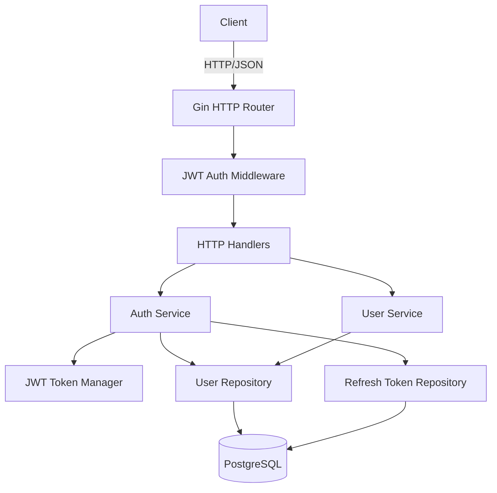

# Design Document — User Service

## Overview

The User Service is a standalone Go microservice responsible for account management within the delivery express platform. It provides a RESTful HTTP API for registration, authentication, profile management, logout, and account lifecycle control. It issues and validates JWTs, stores refresh tokens in PostgreSQL, and operates statelessly for access token validation.

---

## Architecture

The service follows a layered architecture with clear separation of concerns:

```
HTTP Layer (Gin router + middleware)
        │
Handler Layer (request parsing, response formatting)
        │
Service Layer (business logic, validation, token management)
        │
Repository Layer (database access via sqlx / pgx)
        │
PostgreSQL Database
```



---

## Components and Interfaces

### 1. HTTP Router (`internal/transport/http`)

Built with [Gin](https://github.com/gin-gonic/gin). Routes:

| Method | Path | Auth Required | Description |
|--------|------|---------------|-------------|
| POST | `/users/register` | No | Register new account |
| POST | `/auth/login` | No | Login, receive token pair |
| POST | `/auth/refresh` | No | Refresh access token |
| POST | `/auth/logout` | No | Revoke refresh token |
| GET | `/users/{user_id}` | Yes | Get user profile |
| PUT | `/users/{user_id}` | Yes | Update user profile |
| PUT | `/admin/users/{user_id}/status` | Yes (Admin) | Activate/deactivate account |

### 2. JWT Auth Middleware (`internal/middleware`)

- Validates `Authorization: Bearer <token>` on protected routes
- Extracts claims (`user_id`, `role`) and injects into request context
- Returns `401 Unauthorized` for missing or invalid tokens

### 3. Auth Service (`internal/service/auth`)

```go
type AuthService interface {
    Register(ctx context.Context, req RegisterRequest) (RegisterResponse, error)
    Login(ctx context.Context, req LoginRequest) (TokenPairResponse, error)
    RefreshToken(ctx context.Context, refreshToken string) (AccessTokenResponse, error)
    Logout(ctx context.Context, refreshToken string) error
}
```

### 4. User Service (`internal/service/user`)

```go
type UserService interface {
    GetProfile(ctx context.Context, userID string) (UserProfile, error)
    UpdateProfile(ctx context.Context, userID string, req UpdateProfileRequest) (UpdateProfileResponse, error)
    SetAccountStatus(ctx context.Context, targetID string, active bool) error
}
```

### 5. Token Manager (`internal/token`)

```go
type TokenManager interface {
    GenerateAccessToken(userID, role string) (string, expiresIn int, error)
    GenerateRefreshToken(userID string) (string, error)
    ValidateAccessToken(token string) (*Claims, error)
    ValidateRefreshToken(token string) (*Claims, error)
}
```

### 6. User Repository (`internal/repository`)

```go
type UserRepository interface {
    Create(ctx context.Context, user User) (User, error)
    FindByEmail(ctx context.Context, email string) (User, error)
    FindByID(ctx context.Context, id string) (User, error)
    Update(ctx context.Context, user User) (User, error)
    SetStatus(ctx context.Context, id string, active bool) error
}
```

### 7. Refresh Token Repository (`internal/repository`)

```go
type RefreshTokenRepository interface {
    Save(ctx context.Context, token RefreshToken) error
    FindByTokenHash(ctx context.Context, hash string) (RefreshToken, error)
    Revoke(ctx context.Context, tokenHash string) error
    DeleteExpired(ctx context.Context) error
}
```

---

## Data Models

### User (database model)

```go
type User struct {
    ID           string    `db:"user_id"`
    Name         string    `db:"name"`
    Email        string    `db:"email"`
    Phone        string    `db:"phone"`
    PasswordHash string    `db:"password_hash"`
    Role         Role      `db:"role"`
    IsActive     bool      `db:"is_active"`
    CreatedAt    time.Time `db:"created_at"`
}
```

### RefreshToken (database model)

```go
type RefreshToken struct {
    TokenID   string    `db:"token_id"`
    UserID    string    `db:"user_id"`
    TokenHash string    `db:"token_hash"`
    ExpiresAt time.Time `db:"expires_at"`
}
```

### Role

```go
type Role string

const (
    RoleCustomer Role = "CUSTOMER"
    RoleCourier  Role = "COURIER"
    RoleAdmin    Role = "ADMIN"
)
```

### API Request / Response Shapes

**Register Request**
```json
{
  "name": "string",
  "email": "string",
  "phone": "string",
  "password": "string",
  "role": "CUSTOMER | COURIER | ADMIN"
}
```

**Register Response**
```json
{ "user_id": "USR123", "status": "CREATED" }
```

**Login Request / Response**
```json
// Request
{ "email": "string", "password": "string" }

// Response
{ "access_token": "jwt...", "refresh_token": "jwt...", "expires_in": 3600 }
```

**Refresh Token Request / Response**
```json
// Request
{ "refresh_token": "jwt..." }

// Response
{ "access_token": "jwt...", "expires_in": 3600 }
```

**Logout Request / Response**
```json
// Request
{ "refresh_token": "jwt..." }

// Response
{ "status": "LOGGED_OUT" }
```

**Get Profile Response**
```json
{
  "user_id": "USR123",
  "name": "string",
  "email": "string",
  "phone": "string",
  "role": "CUSTOMER | COURIER | ADMIN",
  "is_active": true,
  "created_at": "2026-03-22T08:00:00Z"
}
```

**Update Profile Request / Response**
```json
// Request
{ "name": "string", "phone": "string" }

// Response
{ "user_id": "USR123", "status": "UPDATED" }
```

### Database Schema (PostgreSQL)

```sql
CREATE TABLE users (
    user_id       UUID PRIMARY KEY DEFAULT gen_random_uuid(),
    name          TEXT NOT NULL,
    email         TEXT UNIQUE NOT NULL,
    phone         TEXT NOT NULL DEFAULT '',
    password_hash TEXT NOT NULL,
    role          TEXT NOT NULL CHECK (role IN ('CUSTOMER', 'COURIER', 'ADMIN')),
    is_active     BOOLEAN NOT NULL DEFAULT TRUE,
    created_at    TIMESTAMPTZ NOT NULL DEFAULT NOW()
);

CREATE TABLE refresh_tokens (
    token_id   UUID PRIMARY KEY DEFAULT gen_random_uuid(),
    user_id    UUID NOT NULL REFERENCES users(user_id) ON DELETE CASCADE,
    token_hash TEXT UNIQUE NOT NULL,
    expires_at TIMESTAMPTZ NOT NULL
);
```

---

## Correctness Properties

*A property is a characteristic or behavior that should hold true across all valid executions of a system — essentially, a formal statement about what the system should do. Properties serve as the bridge between human-readable specifications and machine-verifiable correctness guarantees.*

### Property 1: Valid registration always creates a user

*For any* valid name, email, phone, password (length >= 8), and role (`CUSTOMER`, `COURIER`, or `ADMIN`), calling Register should succeed and return a non-empty `user_id` with status `CREATED`.

**Validates: Requirements 1.1**

---

### Property 2: Invalid email is always rejected

*For any* string that does not conform to a valid email format, a registration request using that string as the email should be rejected with a validation error.

**Validates: Requirements 1.3**

---

### Property 3: Short password is always rejected

*For any* password string with length less than 8 characters, both registration requests and password change requests using that string should be rejected with a validation error.

**Validates: Requirements 1.4, 5.3**

---

### Property 4: Invalid role is always rejected

*For any* string that is not `CUSTOMER`, `COURIER`, or `ADMIN`, a registration request using that string as the role should be rejected with a validation error.

**Validates: Requirements 1.5**

---

### Property 5: Password is never stored in plaintext

*For any* user created via registration, the value stored in the `password_hash` column should not equal the plaintext password submitted during registration.

**Validates: Requirements 1.6**

---

### Property 6: Valid login always returns a token pair

*For any* registered and active user, submitting the correct credentials should always return a non-empty `access_token`, a non-empty `refresh_token`, and a positive `expires_in` value.

**Validates: Requirements 2.1**

---

### Property 7: Wrong password always fails login

*For any* registered user, submitting a password that differs from the registered password should always return an authentication error.

**Validates: Requirements 2.3**

---

### Property 8: Token expiry is within expected bounds

*For any* successful login, the Access Token's `exp` claim should be approximately 3600 seconds from issuance (within a 60-second tolerance).

**Validates: Requirements 2.4**

---

### Property 9: Valid refresh token always yields a new access token

*For any* valid and unexpired Refresh Token, calling RefreshToken should return a non-empty `access_token` and a positive `expires_in`.

**Validates: Requirements 3.1**

---

### Property 10: Malformed refresh token is always rejected

*For any* string that is not a valid JWT, calling RefreshToken with that string should return an authentication error.

**Validates: Requirements 3.3**

---

### Property 11: Profile response never contains password hash

*For any* user, the JSON profile response returned by GetProfile should not contain a `password_hash` field.

**Validates: Requirements 4.1, 8.1**

---

### Property 12: Valid profile update is reflected in the response

*For any* authenticated user and valid `name` and `phone` values, submitting a profile update should return status `UPDATED`, and a subsequent GetProfile call should return the new values.

**Validates: Requirements 4.2, 4.3**

---

### Property 13: Invalid phone number is always rejected

*For any* string that does not conform to a valid phone number format, a profile update request using that string as the phone field should be rejected with a validation error.

**Validates: Requirements 4.4**

---

### Property 14: Correct current password allows password change

*For any* user, submitting the correct current password and a valid new password (length >= 8) should succeed, and the stored password hash should differ from the previous hash.

**Validates: Requirements 5.1**

---

### Property 15: Wrong current password blocks password change

*For any* user, submitting an incorrect current password in a password change request should always return an authentication error.

**Validates: Requirements 5.2**

---

### Property 16: Account deactivation/reactivation round-trip

*For any* active user, deactivating the account should set `is_active` to false, and subsequently reactivating it should set `is_active` back to true.

**Validates: Requirements 6.1, 6.2**

---

### Property 17: Deactivated user cannot authenticate

*For any* deactivated user, submitting correct credentials should always return an authorization error.

**Validates: Requirements 6.3**

---

### Property 18: Non-admin cannot change account status

*For any* user with role `CUSTOMER` or `COURIER`, attempting to call the account status endpoint should always return an authorization error.

**Validates: Requirements 6.4**

---

### Property 19: Logout revokes the refresh token

*For any* valid refresh token, calling Logout should succeed, and a subsequent RefreshToken call using the same token should return an authentication error.

**Validates: Requirements (Logout)**

---

### Property 20: JSON serialization round-trip

*For any* valid User object, serializing it to JSON and then deserializing the result should produce an object equivalent to the original (excluding `password_hash`).

**Validates: Requirements 8.4**

---

### Property 21: Unknown JSON fields are ignored on deserialization

*For any* valid user JSON payload with additional unknown fields appended, deserialization should succeed and the known fields should match the expected values.

**Validates: Requirements 8.3**

---

## Error Handling

All errors are returned as JSON with a consistent envelope:

```json
{
  "error": {
    "code": "VALIDATION_ERROR",
    "message": "password must be at least 8 characters"
  }
}
```

| Scenario | HTTP Status | Error Code |
|---|---|---|
| Validation failure | 400 | `VALIDATION_ERROR` |
| Wrong credentials / bad token | 401 | `AUTHENTICATION_ERROR` |
| Insufficient role | 403 | `AUTHORIZATION_ERROR` |
| Resource not found | 404 | `NOT_FOUND` |
| Duplicate email | 409 | `CONFLICT` |
| Internal server error | 500 | `INTERNAL_ERROR` |

Sensitive details (e.g., SQL errors) are logged server-side and never exposed in API responses.

---

## Testing Strategy

### Unit Tests

Unit tests cover specific examples and edge cases at the service and validation layers:

- Registration with boundary password lengths (7 chars fails, 8 chars passes)
- Login with unknown email returns auth error
- Expired refresh token returns auth error
- Admin-only endpoint returns 403 for CUSTOMER/COURIER roles
- Profile response struct does not contain `password_hash` field
- Logout with already-revoked token returns auth error

### Property-Based Tests

The property-based testing library used is **[`pgregory.net/rapid`](https://github.com/pgregory/rapid)** — a Go-native PBT library with built-in generators.

Each property-based test must:
- Run a minimum of **100 iterations**
- Be tagged with a comment: `// Feature: user-service, Property {N}: {property_text}`
- Reference the requirements clause: `// Validates: Requirements X.Y`
- Use smart generators that constrain inputs to the valid input space

Each correctness property (Properties 1–21) maps to exactly one property-based test function.

### Test File Layout

```
internal/
  service/
    auth/
      auth_service_test.go       # unit + property tests for auth
    user/
      user_service_test.go       # unit + property tests for user
  token/
    token_manager_test.go        # unit + property tests for JWT
  repository/
    user_repo_test.go            # integration tests against test DB
    token_repo_test.go
  transport/http/
    handlers_test.go             # HTTP handler tests
```
